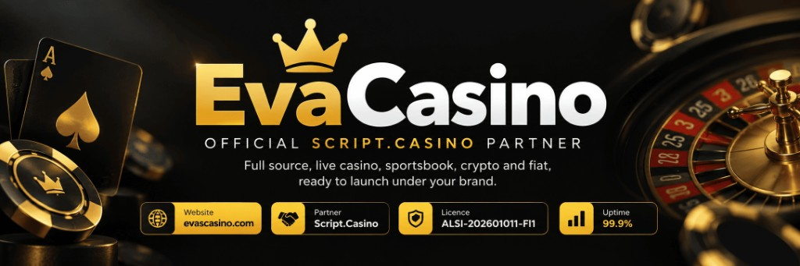
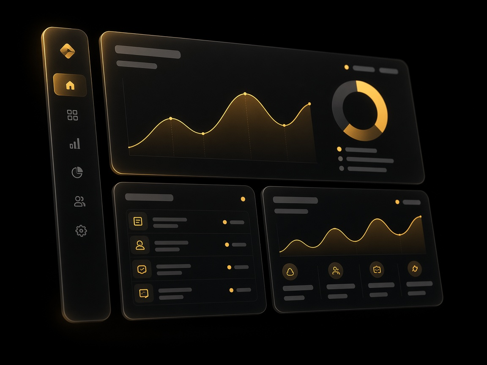
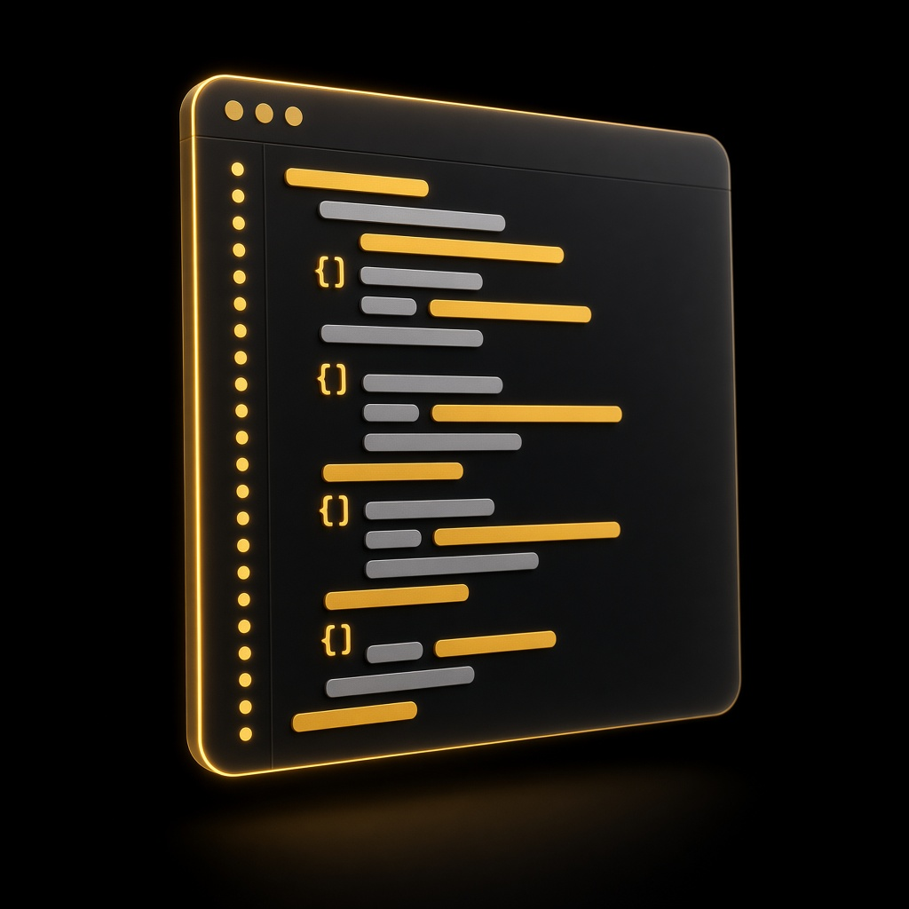
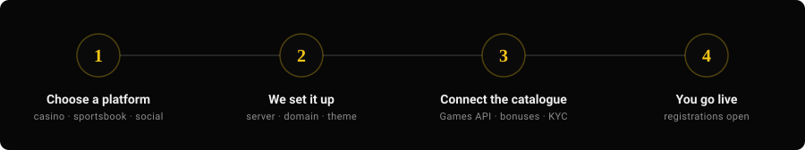

 

 

 

 

## The short version

<table>
<tr>
<td width="56%" valign="top">

EvaCasino is an official **[Script.Casino](https://script.casino)** partner. This account documents the **source-available casino platforms** we help licensed operators deploy — admin, players, bonuses, reports, themes, and one API into a 15,000+ title catalogue.

You get unencrypted source and a stack that is already running, not an empty repository. We handle the setup and stay on as your technical contact.

**Brand, licence, and operations stay yours.**

This is software documentation. Nothing here accepts a wager, and nothing here is an offer to gamble.

</td>
<td width="44%" valign="top">

</td>
</tr>
</table>

## What ships with the stack

<table>
<tr>
<td width="25%" align="center" valign="top">
 
<strong>Full source</strong> 
Unencrypted. Admin, players, bonuses, reports, docs.
</td>
<td width="25%" align="center" valign="top">
 
<strong>One catalogue</strong> 
Slots, crash, table, jackpot, sportsbook via Games API.
</td>
<td width="25%" align="center" valign="top">
 
<strong>Live tables</strong> 
Third-party live-dealer studios. Their marks stay theirs.
</td>
<td width="25%" align="center" valign="top">
 
<strong>Your brand</strong> 
Theme, lobby, custom work. Domain and hosting included.
</td>
</tr>
</table>

## Platforms

Eight source platforms and the API that feeds them. Each one is software we deploy for an operator — none of them runs on GitHub.

<table>
<tr>
<td width="33%" valign="top"><strong>HyperPlay</strong> Modern lobby and admin, clean UI</td>
<td width="33%" valign="top"><strong>Imperium</strong> Flagship stack — wallet, bonuses, reports</td>
<td width="33%" valign="top"><strong>GammaX</strong> Full casino source — games, slots, wallet</td>
</tr>
<tr>
<td valign="top"><strong>SlotNova</strong> Slot-first lobby with a fresh front end</td>
<td valign="top"><strong>CrashBot</strong> Crash games and sportsbook in one stack</td>
<td valign="top"><strong>BetCore</strong> Customisable source for an operator build</td>
</tr>
<tr>
<td valign="top"><strong>Oraux</strong> Modular lobby wired to the Games API</td>
<td valign="top"><strong>BlaxeBet</strong> Social-style casino skin</td>
<td valign="top"><strong>Games API</strong> · core One integration, 15,000+ titles</td>
</tr>
</table>

Full specifications: <a href="https://evascasino.com/">evascasino.com</a>

## How a deployment works

| | You decide | We handle |
| :---: | :--- | :--- |
| **1** | Casino, sportsbook, or social skin | Matching you to the right source |
| **2** | Brand, domain, market | Server, theme, environment |
| **3** | Which catalogues to enable | Games API, bonuses, KYC hooks |
| **4** | Registrations and operations | Ongoing technical support |

Most standard deployments go live within days, once branding, domain, hosting, and operator credentials are ready.

## Questions we get

<strong>What exactly is EvaCasino's role?</strong>

 

We are an official Script.Casino partner. We introduce the platforms, coordinate the deployment, and stay as your point of contact. We do not operate a casino, and we do not operate one on GitHub.

<strong>Do I really get the source code?</strong>

 

Yes. Licensed operators receive the complete, unencrypted source and its documentation — admin, player area, bonus engine, reporting, and themes.

<strong>How long until it is live?</strong>

 

Days, for a standard deployment, once your branding, domain, hosting, and operator details are ready. Custom work extends that.

<strong>Does your licence cover my brand?</strong>

 

No. Your operation needs its own licensing for every market it serves. The Anjouan certificate **ALSI-202601011-FI1** belongs to EvaCasino and does not license your site.

<strong>Can I change the platform after launch?</strong>

 

Yes — the source is yours to modify. You can restyle it, extend it, or commission custom work from us.

## Talk to us

For licensed operators who want a Script.Casino stack under their own brand.

 

## Running this on GitHub

This profile is **software documentation and partner coordination**. It is for licensed operators, aged 18 or over, and no one can play or wager anywhere on this account.

How this account stays inside GitHub's policies

 

| Rule | How this profile applies it |
| :--- | :--- |
| **Lawful use** | Operators must comply with their own jurisdiction's licensing and advertising law. |
| **Not primarily advertising** | Images, links, and text describe the software this account represents, which is what [GitHub allows in a README](https://docs.github.com/en/site-policy/acceptable-use-policies/github-acceptable-use-policies#10-advertising-on-github). We never post promotional content in other users' issues or accounts. |
| **No third-party IP** | Studio names, game titles, and artwork belong to their owners. Every graphic on this page is original. |
| **No payment rails** | Nothing here promotes deposits, payouts, or payment processing. |
| **Trademarks** | "EvaCasino" and "Script.Casino" identify the partner programme. Other marks remain with their owners. |

Reference: [GitHub Terms of Service](https://docs.github.com/site-policy/github-terms/github-terms-of-service) · [Acceptable Use Policies](https://docs.github.com/en/site-policy/acceptable-use-policies/github-acceptable-use-policies)

 

**© 2026 EvaCasino** · Official Script.Casino partner

Certificate ALSI-202601011-FI1 · <a href="https://evascasino.com/">Privacy</a> · <a href="https://evascasino.com/">Terms</a>

